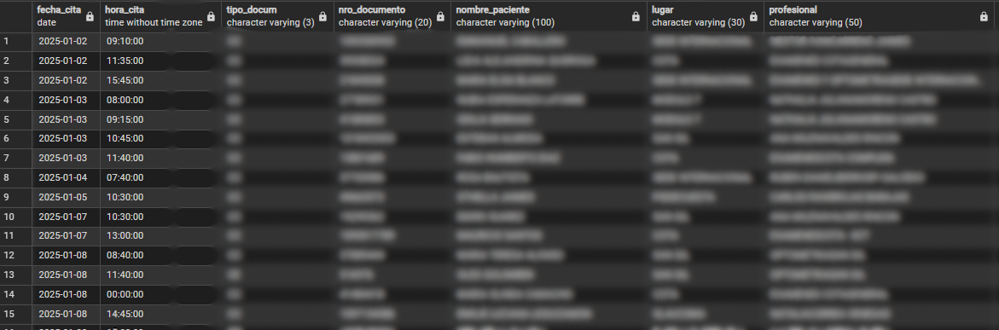
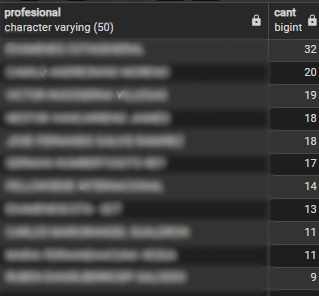

# 📊 Base de Datos para Asignación de Citas - PosgreSQL

## Descripción
Esta base de datos está diseñada para instituciones de salud, con el objetivo de controlar la asignación de citas médicas. Actualmente, los datos están dirigidos a la asignación de citas de medicina para la salud visual.

## Estructura de la Base de Datos
La base de datos consta de **12 tablas**:
- **11 tablas de parametrización**:
  Los datos de parametrización contienen valores como:
  - Datos de pacientes 🧑‍⚕️
  - Profesionales disponibles 👩‍⚕️
  - Consultorios 🏥
  - Tipos de citas 📅
  - ... y más.
- **1 tabla de transacciones**:
  - Registro de citas asignadas 📋

## Vistas
La base de datos incluye **algunas vistas** que resumen el contenido, para facilitar su consulta entre ellas tenemos:
1. **Vista de citas**: Permite visualizar los datos de las citas asignadas.
2. **Vista de ranking de profesionales**: Muestra el ranking de profesionales según la cantidad de citas asignadas.

A continuación te muestro algunas imágenes de la base de datos:

## Diagrama Entidad-Relación

## Resultados de las Vistas
1. **Vista de citas**:
   

2. **Vista de ranking de profesionales**:
   

## Uso
Para utilizar esta base de datos, sigue los siguientes pasos:
1. Clona el repositorio.
2. Configura tu entorno PostgreSQL.
3. Importa las tablas y vistas.
4. ¡Comienza a asignar citas médicas! 🚀

## Contribuciones
Las contribuciones son bienvenidas. Por favor, sigue las directrices de contribución y abre un issue para discutir cualquier cambio importante.

---

Espero que esto te sea útil.😊
